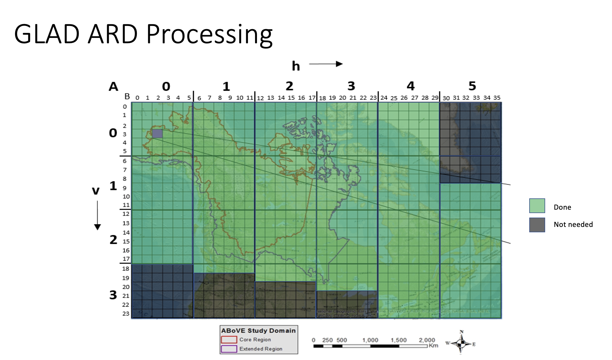

# Landsat GLAD ARD

The Landsat GLAD ARD dataset is a collection of harmonized Landsat data developed by the GLAD UMD
group. The ILAB group is responsible for curating this dataset in the CSS system at the NCCS. The
scripts from this directory are part of the processing required to keep this data archive updated.

The main customer of the GLAD ARD data is the ABoVE group. Thus, the data gets 1) downloaded,
2) regridded, and 3) stored under the CSS domain with symlinks in the ABoVE data directory.



The data has two paths at the NCCS:
  - /css/landsat/Collection2/GLAD_ARD/Native_Grid: original data files downloaded from GLAD ARD
  - /css/landsat/Collection2/GLAD_ARD/ABoVE_Grid: regridded dataset using the ABoVE domain

An additional symlink to the data is under /css/above/glad.umd.edu/Collection2/GLAD_ARD.

## Quick Start

Go to working directory:

```bash
cd /explore/nobackup/projects/ilab/software/ilab-geoproc/ilab_geoproc/landsat
```

Activate anaconda environment:

```bash
module load anaconda
conda activate ilab-pytorch
```


## Methods

## Copy Data from One Dir to Another

This is an example of how to copy data from one temporary directory to another.

```bash
rsync -av /explore/nobackup/projects/ilab/data/LandSatARD_C2_ABoVE_TEMP/51N/ /css/landsat/Collection2/GLAD_ARD/Native_Grid/51N
```

### 1. GLAD ARD Downloader

```bash

```

## GladRegridder Over LandSat Data

singularity exec -B /adapt/nobackup/people/jacaraba,/adapt/nobackup/projects/ilab,/css/above /adapt/nobackup/projects/ilab/containers/ilab-base_gdal-3.3.3.sif python /adapt/nobackup/people/jacaraba/development/geoProc/geoproc/aviris/regridder.py -f '/css/above/daac.ornl.gov/daacdata/above/ABoVE_Airborne_AVIRIS_NG/data/*rfl/*_rfl_*/*_*_img' -o /css/above/AVIRIS_Analysis_Ready -to /adapt/nobackup/projects/ilab/data/Aviris/AvirisAnalysisReady


python /adapt/nobackup/people/jacaraba/development/geoProc/geoproc/landsat/GladRegridder.py -f '/css/above/daac.ornl.gov/daacdata/above/ABoVE_Airborne_AVIRIS_NG/data/*rfl/*_rfl_*/*_*_img'


python /adapt/nobackup/people/jacaraba/development/geoProc/geoproc/landsat/GladRegridder.py -f '/adapt/nobackup/projects/ilab/data/LandSatABoVE/54N/*/*.tif' -o /adapt/nobackup/projects/ilab/data/LandSatABoVE/test


